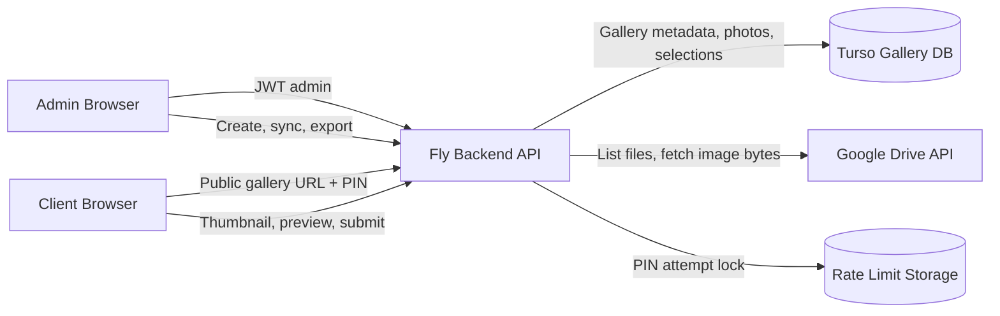
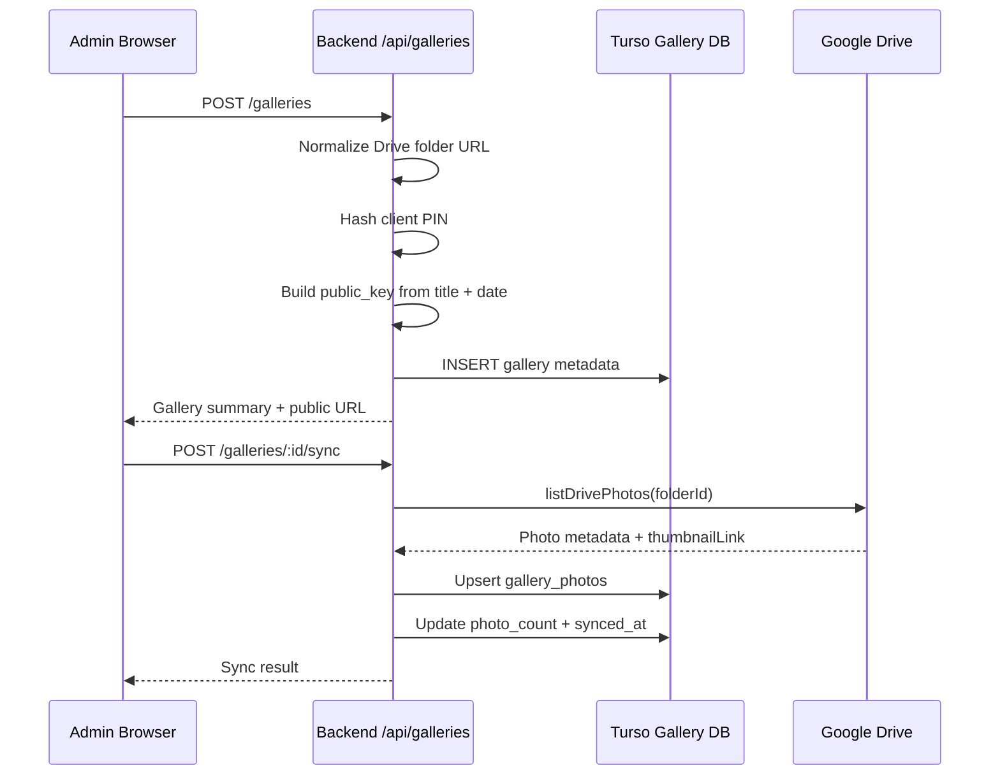
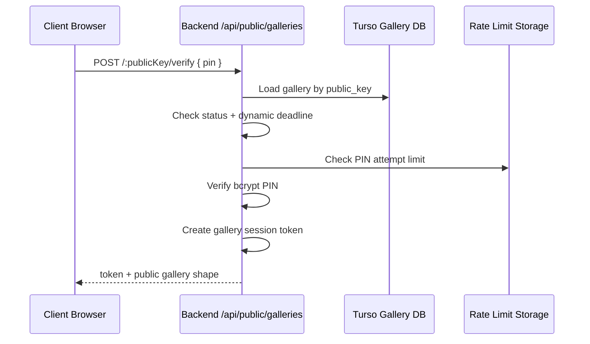
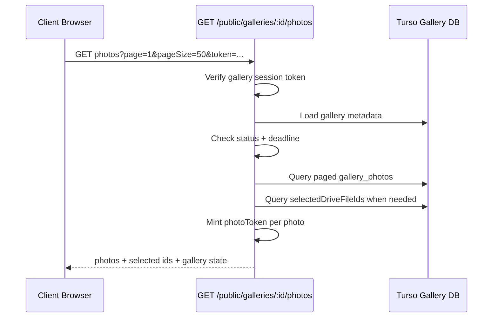
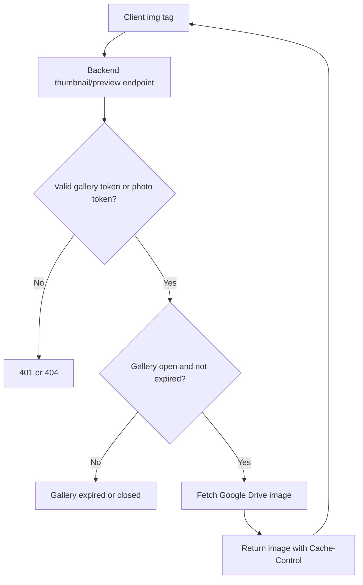
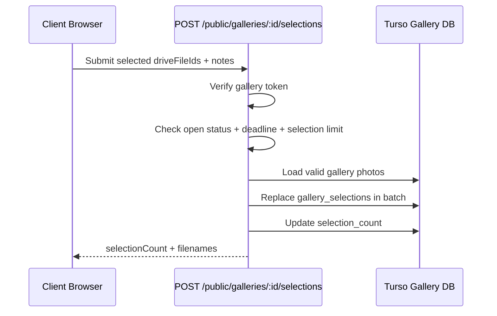
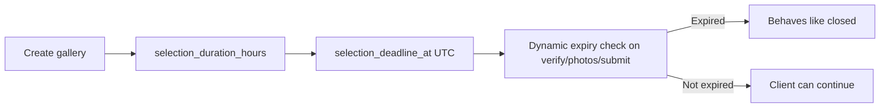
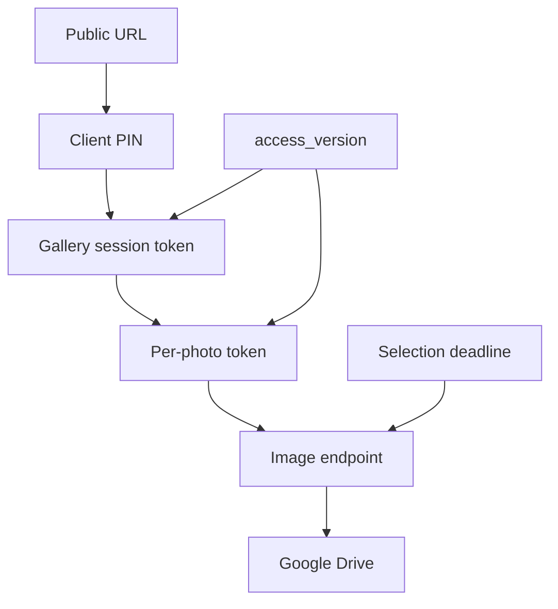

# Client Gallery Infrastructure

Dokumen ini menjelaskan alur kerja Client Culling Gallery: dari admin membuat gallery, sync foto dari Google Drive, client membuka PIN, memilih foto, sampai submit pilihan.

## High Level Architecture



Main idea:

- Browser selalu masuk lewat backend dulu, supaya PIN, token, deadline, dan photo token tetap divalidasi.
- Turso menyimpan metadata kecil: gallery, foto, selection, deadline, dan add-on.
- Binary image tidak disimpan di Turso.
- Thumbnail dan preview diambil dari Google Drive melalui backend image endpoint.
- Supabase Storage image cache tidak aktif pada arsitektur saat ini.

## Public URL Naming

Gallery baru memakai public key berbasis judul dan tanggal create.

```text
/culling/{title-slug}-{yyyymmdd}
```

Contoh:

```text
/culling/kevin-putri-prewedding-20260904
```

Catatan:

- Existing gallery lama tetap bisa memakai public key lama.
- `public_key` tetap unik di database.
- Jika ada dua gallery dengan judul sama pada tanggal yang sama, database akan menolak create karena URL bentrok.

## Admin Flow



Admin responsibilities:

- Create gallery with title, Drive folder, PIN, selection limit, and selection window in hours.
- Sync Drive folder when photos are ready.
- Open or close gallery status.
- Export submitted selection as CSV/XLSX.

## Client Unlock Flow



Important behavior:

- Gallery status must be `open`.
- Expired deadline behaves like closed gallery.
- PIN failures are rate-limited.
- Client receives a short lived gallery session token.
- Frontend stores token in localStorage per gallery.

## Photo List Flow



Frontend behavior:

- Page size is fixed at 50.
- Grid thumbnail uses backend thumbnail URL.
- Lightbox opens by `driveFileId`, not by fragile page index.
- Picked filter uses local selection state before submit, so client can review choices first.
- Browser draft stores selected ids and notes in localStorage.

## Image Delivery Flow



Image variants:

| Variant | Endpoint | Google Drive size | Purpose |
| --- | --- | --- | --- |
| Thumbnail | `/photos/:fileId/thumbnail` | width 320 | Grid image |
| Preview | `/photos/:fileId/preview` | width 1600 | Lightbox image |
| Content | `/photos/:fileId/content` | original | Manual/original access only |

Notes:

- Thumbnail grid may be cropped visually by CSS.
- Preview keeps the original frame using width-only Drive resize.
- Browser image cache is private and long-lived while token remains valid.
- Frontend also keeps a small in-memory preview cache for smoother lightbox navigation.

## Submit Selection Flow



Selection rules:

- Client can revise choices and submit again.
- Submitted rows are replaced with the latest selection.
- Selection count cannot exceed gallery master limit plus approved add-on limit.
- Notes are stored per selected photo.

## Deadline Model



There is no cron requirement.

Every public request checks whether `selection_deadline_at` has passed. Admin UI can show expired galleries as closed. To reopen an expired gallery, admin sets a new duration/window and opens the gallery again.

## Security Layers



Security controls:

- Public URL alone is not enough.
- PIN unlock creates session token.
- Photo token avoids repeated DB lookup for every image when possible.
- `access_version` invalidates old tokens after sensitive updates.
- Selection deadline can shorten effective photo token lifetime.
- PIN attempt lock prevents brute force.

## Data Stores

| Store | Data |
| --- | --- |
| `galleries` | Title, public key, Drive folder, PIN hash, status, limits, deadline, counts |
| `gallery_photos` | Drive file id, filename, mime type, thumbnail link, dimensions, order |
| `gallery_selections` | Submitted drive file id, filename, note, submitted timestamp |
| `gallery_settings` | Admin WhatsApp number and message templates |
| Rate limit storage | PIN attempt lock data |
| Google Drive | Source image files and generated thumbnails/previews |

## Key Endpoints

Admin:

```text
GET    /api/galleries
POST   /api/galleries
GET    /api/galleries/:id
PATCH  /api/galleries/:id
POST   /api/galleries/:id/sync
GET    /api/galleries/:id/export.csv
GET    /api/galleries/:id/export.xlsx
```

Public client:

```text
GET    /api/public/galleries/:id/contact
POST   /api/public/galleries/:id/verify
GET    /api/public/galleries/:id/photos
GET    /api/public/galleries/:id/photos/:fileId/thumbnail
GET    /api/public/galleries/:id/photos/:fileId/preview
GET    /api/public/galleries/:id/photos/:fileId/content
POST   /api/public/galleries/:id/selections
```

## Cost And Performance Notes

- Turso stores metadata only, not binary photos.
- `photo_count` and `selection_count` avoid repeated expensive count scans.
- Public settings are cached in memory for short periods.
- Google Drive image fetch is the main image path.
- Supabase egress is not expected from Client Gallery images unless a future Supabase Storage cache is reintroduced.
- Fixed page size 50 keeps payload predictable and avoids user-driven heavy loads.

