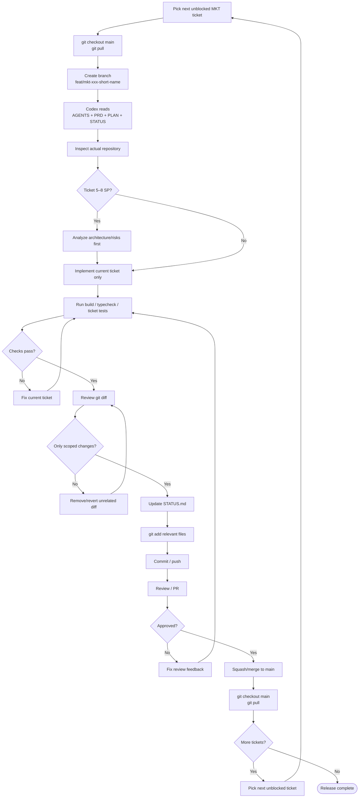
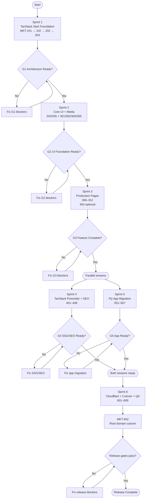
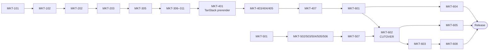

# Codex + Git Workflow

## Ticket Workflow



## Six-Sprint Flow



## Critical Path



## Branch Naming

Examples:

```text
feat/mkt-101-tanstack-marketing-workspace
feat/mkt-102-tanstack-rsbuild-setup
feat/mkt-202-marketing-routes
feat/mkt-301-marketing-layout
feat/mkt-401-tanstack-prerender
feat/mkt-403-route-seo
fix/mkt-503-api-cors
chore/mkt-602-domain-cutover
```

## Commit Naming

Examples:

```text
feat(marketing): initialize tanstack start workspace [MKT-101]
build(marketing): configure tanstack start with rsbuild [MKT-102]
feat(marketing): add file-based marketing routes [MKT-202]
feat(marketing): add typed content layer [MKT-203]

feat(marketing): add global marketing layout [MKT-301]
feat(marketing): build hero showreel [MKT-302]
feat(portfolio): build bento portfolio grid [MKT-303]
feat(marketing): add reusable service template [MKT-305]

feat(ssg): configure tanstack start prerendering [MKT-401]
fix(ssr): resolve marketing hydration boundaries [MKT-402]
feat(seo): add route-native metadata [MKT-403]
feat(seo): add structured data [MKT-404]
feat(seo): configure tanstack sitemap [MKT-405]
feat(seo): add marketing robots.txt [MKT-406]
test(seo): validate static marketing output [MKT-407]

chore(fly): configure app subdomain [MKT-501]
refactor(app): migrate public app urls [MKT-502]
fix(api): update cors origins [MKT-503]
fix(auth): review app cookie scope [MKT-504]

ci(marketing): deploy prerendered site to cloudflare [MKT-601]
chore(domain): cut over root marketing domain [MKT-602]
feat(routing): redirect legacy app routes [MKT-603]
```

## Recommended Solo-Vibecoding Rule

```text
1 ticket
→ 1 branch
→ Codex implement
→ validate
→ review diff manually
→ update STATUS.md
→ 1 clean squash commit
→ merge main
→ pull main
→ next unblocked ticket
```

Do not keep MKT-101 through MKT-609 on one long-lived feature branch.
